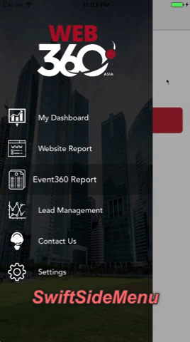
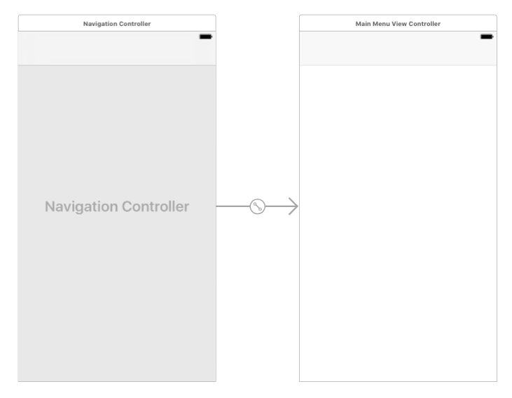

# SwiftySideMenuO


## Demo


This is a fully customizable side menu controller written in Swift.

- [Features](#features)
- [Requirements](#requirements)
- [Communication](#communication)
- [Installation](#installation)
- [Usage](#usage)

## Features

- [x] Smooth Transition between pages.
- [x] Customizable menue button image.
- [x] Customizable menue side bar top view.
- [x] Customizable icons for side menu items.
- [x] Lightweight Library.
- [x] Customizable side menu tableview.

## Requirements

- iOS 8.0+
- Xcode 8.0+
- Swift 3.0, 3.1, 3.2, and 4.0

## Communication

- If you **found a bug**, open an issue.
- If you **have a feature request**, open an issue.
- If you **want to contribute**, submit a pull request.


## Installation

To integrate SwiftySideMenu into your Xcode project using CocoaPods, specify it in your `Podfile`:

```ruby
source 'https://github.com/CocoaPods/Specs.git'
platform :ios, '9.0'
use_frameworks!

target '<Your Target Name>' do
    pod 'SwiftySideMenuO', '~> 1.2.0'
end
```

If you want to use library without cocoapods, just use like this:- 

```ruby
source 'https://github.com/CocoaPods/Specs.git'
platform :ios, '9.0'
use_frameworks!

target '<Your Target Name>' do
    pod 'SwiftySideMenuO', :git => 'https://github.com/mudithsilva/SwiftySideMenuO.git'
end
```

Then, run the following command:

```bash
$ pod install
```

## Usage

### SwiftySideMenu Configuration

#### Step 01
First you need to add a ViewController in to your storyboard. And the ViewController need to be embed in Navigation Controller.



#### Step 02
Import `SwiftySideMenuO`. 
Change the `ViewController` type to `SwiftySideMenuViewController` 
Add `SwiftySideMenuDataSource`

eg:-

```
import SwiftySideMenuO

class MainMenuViewController: SwiftySideMenuViewController, SwiftySideMenuDataSource  {

}
```

#### Step 03

