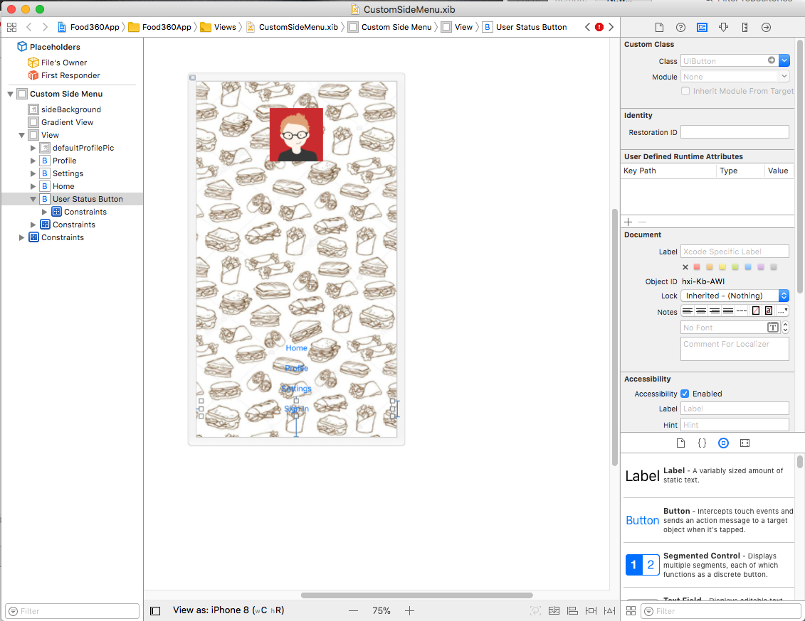

# SwiftySideMenuO


## Demo


This is a fully customizable side menu controller written in Swift.

- [Features](#features)
- [Requirements](#requirements)
- [Communication](#communication)
- [Installation](#installation)
- [Usage](#usage)

## Features

- [x] Smooth Transition between pages.
- [x] Customizable menue button image.
- [x] Customizable menue side bar top view.
- [x] Customizable icons for side menu items.
- [x] Lightweight Library.
- [x] Customizable side menu tableview.

## Requirements

- iOS 8.0+
- Xcode 8.0+
- Swift 3.0+
- Main Menu and Child Controllers should be in the same storyboard.

## Communication

- If you **found a bug**, open an issue.
- If you **have a feature request**, open an issue.
- If you **want to contribute**, submit a pull request.


## Installation

To integrate SwiftySideMenu into your Xcode project using CocoaPods, specify it in your `Podfile`:

```ruby
source 'https://github.com/CocoaPods/Specs.git'
platform :ios, '9.0'
use_frameworks!

target '<Your Target Name>' do
    pod 'SwiftySideMenuO', '~> 1.2.0'
end
```

If you want to use library without cocoapods, just use like this:- 

```ruby
source 'https://github.com/CocoaPods/Specs.git'
platform :ios, '9.0'
use_frameworks!

target '<Your Target Name>' do
    pod 'SwiftySideMenuO', :git => 'https://github.com/mudithsilva/SwiftySideMenuO.git'
end
```

Then, run the following command:

```bash
$ pod install
```

## Usage

### SwiftySideMenu Configuration

#### Step 01
- First you need to add a ViewController in to your storyboard. And the ViewController need to be embed in Navigation Controller.


#### Step 02
- Import `SwiftySideMenuO`. 
- Change the `ViewController` type to `SwiftySideMenuViewController` 
- Add `SwiftySideMenuDataSource`

eg:-

```
import SwiftySideMenuO

class MainMenuViewController: SwiftySideMenuViewController, SwiftySideMenuDataSource  {

}
```

#### Step 03

Connect Data Source and Reference in Main Menu View Controller

```
override func viewDidLoad() {
        self.dataSource = self
        SwiftySideMenuInfo.shared.swiftySideMenu = self
 }
```

#### Step 04

Add your Custom Side view in by calling `menuNavigationTabs(subviewFor sideMenu: UIView)`

```
func menuNavigationTabs(subviewFor sideMenu: UIView) -> UIView {
        /// let view = CustomSideMenu.getView()
        let view = YourCustomSideView
        return view
}
```

#### Step 05

Add side menu pages. Make sure to add correct view controller identifier.

```
func menuNavigationTabs(_ sideView: UIView) -> [SwiftySideMenuChildViewControllers] {
        var childViews: [SwiftySideMenuChildViewControllers] = []
        
            let childView1 = SwiftySideMenuChildViewControllers()
            childView1.tabName = "Home"
            childView1.viewControllerIdentifier = "MainHomeNav"
            childViews.append(childView1)
            
            let childView2 = SwiftySideMenuChildViewControllers()
            childView2.tabName = "My Profile"
            childView2.viewControllerIdentifier = "MyProfileNav"
            childViews.append(childView2)
            
            let childView3 = SwiftySideMenuChildViewControllers()
            childView3.tabName = "Settings"
            childView3.viewControllerIdentifier = "SettingsNav"
            childViews.append(childView3)
        

        return childViews
}

```

 - Switch to Child Controllers in Your Custom View
 
    Call this Functions to open your child controller
    
    ```
    SwiftySideMenuInfo.shared.swiftySideMenu.showClickedTab(selectedIndex: 1) // Opend Secondly added Child Controller
    ```
    
    eg:- Custome View Controller - .swift file
    
    
    ```
    import Foundation
    import UIKit

    public class CustomSideMenu: UIView {
    
    @IBOutlet weak var userStatusButton: UIButton!
    
    var isSignIn: Bool = false

    override public func layoutSubviews() {
        let userID: String = UserDetails.getData(key: UserLoginInfo.userID)
        if userID != "" {
            self.isSignIn = true
            self.userStatusButton.setTitle("Log Out", for: .normal)
        } else {
            self.isSignIn = false
            self.userStatusButton.setTitle("Sign In", for: .normal)
        }
    }

    
    public class func getView() -> CustomSideMenu {
        
        let cellNib = UINib(nibName: "CustomSideMenu", bundle: Bundle(for: CustomSideMenu.self))
        return cellNib.instantiate(withOwner: nil, options: nil)[0] as! CustomSideMenu
    }
    
    @IBAction func showProfile(_ sender: Any) {
        SwiftySideMenuInfo.shared.swiftySideMenu.showClickedTab(selectedIndex: 1)
    }
    
    
    @IBAction func showHome(_ sender: Any) {
        SwiftySideMenuInfo.shared.swiftySideMenu.showClickedTab(selectedIndex: 0)
    }
    
    @IBAction func showSettings(_ sender: Any) {
        SwiftySideMenuInfo.shared.swiftySideMenu.showClickedTab(selectedIndex: 2)
    }
    
    @IBAction func clickedUserStatus(_ sender: Any) {
        if self.isSignIn {
            UserDetails.removeAll()
            SwiftySideMenuInfo.shared.swiftySideMenu.showClickedTab(selectedIndex: 0)
            self.isSignIn = false
            self.userStatusButton.setTitle("Sign In", for: .normal)
        } else {
            let storyboard = UIStoryboard(name: "Main", bundle: nil)
            let controller = storyboard.instantiateViewController(withIdentifier: "SignInViewController")
            SwiftySideMenuInfo.shared.swiftySideMenu.present(controller, animated: true, completion: nil)
        }
    }
 
 }

```

- Custome View Controller - .xib file (image)





#### Step 06

Add side menu naviagtion in Child Controllers.

- Add empty View on the top left in Child Controller. 

  ```
  class MyProfileViewController: UIViewController {
    
    @IBOutlet weak var menuNavigationView: UIView!
    
   

  }
  
  ```
  
- Connect Side menu image. 
  
  ```
  override func viewDidLoad() {
      SwiftySideMenuImageView.addMenuImageView(addMenuViewTo: menuNavigationView)
  }
    
  ```
    
#### Step 07

- Clean , Build and Run Project :)


